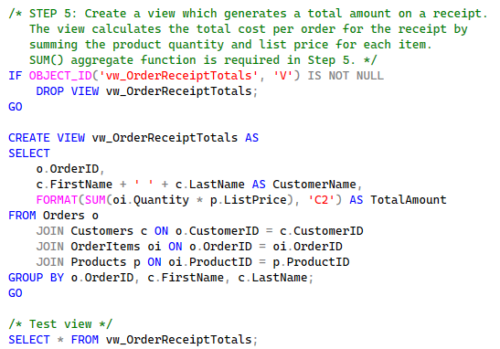
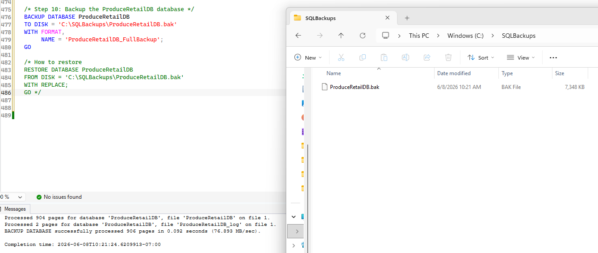

# **ProduceRetailDB – SQL Retail Management System**

A SQL Server database project demonstrating schema design, data integrity, transactions, triggers, security, and backup operations.

---

## 🎥 Project Walkthrough Video

This video provides a complete demonstration of the Produce Retail Database:

▶️ **[Watch the full walkthrough](./ProduceRetailDB_Walkthrough.mp4)** 

---

## **📌 Project Overview**

ProduceRetailDB is a fully designed SQL Server database created for a comprehensive SQL II final project. The goal was to build a functional retail management system that supports customers, orders, products, and inventory workflows while demonstrating real‑world database concepts such as:

- Normalized table design  
- Data validation and constraints  
- Transactions and error handling  
- Triggers for automated data enforcement  
- Role‑based security  
- Backup and recovery  
- Testing and verification queries  

This project simulates the backend of a small fruit and vegetable retail business and is structured to be scalable, maintainable, and production‑ready.

---

## **🗂️ Database Schema**

The database includes the following core tables:

- **Customers** – customer profiles and contact information  
- **Products** – product catalog  
- **Orders** – order headers  
- **OrderItems** – line‑item details for each order  
- **Inventory** – stock levels  

Each table includes primary keys, foreign keys, and appropriate data types to ensure referential integrity.

**Five Core Tables Created**  


**Database Diagram Showing Relationships**  


---

## 🧩 Step 1 to 6 Implementation

#### ✅ Created Tables and Constraints
Built all required tables with primary keys, foreign keys, and a `CHECK` constraint to prevent negative inventory quantities.

**CHECK Constraint Example**
  


---

#### 🧾 Inserted Sample Data
Populated the database with sample customers, products, orders, order items, and inventory records.

---

#### 📊 Created View for Receipt Totals
Designed a view using aggregate functions to calculate order totals.

**View Example**
  


---

#### ⚙️ Built Stored Procedures
Developed stored procedures for retail sales metrics, including filtering with multiple parameters.

**Example Procedure With 2 Parameters**
  


---

#### 🧾 Generated Receipt Formats
Created stored procedures to produce multiple receipt types:
- Traditional join output  
- Readable formatted receipt  
- ASCII‑style receipt  

**ASCII Style Receipt**
  


---

### **Step 7: Data Standardization & Trigger Creation**

#### **Part 1 – Capitalize All Existing Customer Last Names**  
A transaction was used to update all existing customer last names to uppercase.

#### **Part 2 – Trigger to Enforce Uppercase on Future Inserts/Updates**  
A trigger was created to automatically uppercase last names whenever a customer is added or modified.

#### **Part 3 – Trigger Testing**  
A test insert was wrapped in a transaction and rolled back to keep the table clean.

**Trigger**  


---

### **Step 8: Inventory‑Safe Order Transaction**

A full transaction block was created to ensure that orders cannot be placed for items that are out of stock.

**Logic flow:**

- Check inventory  
- If enough stock → insert order + order items + update inventory  
- If not → rollback and print an error message  

This demonstrates atomicity and real‑world retail logic.

**Transaction**  


---

### **Step 9: Security – Admin & Staff Users**

Two SQL Server logins and database users were created:

- **AdminUser** → full control (`db_owner`)  
- **StaffUser** → read‑only (`db_datareader`)  

Verification queries were used to confirm role membership.

**Login And User Creation**  


---

### **Step 10: Database Backup**

A full `.bak` backup of the database was created using a T‑SQL backup command.  
This demonstrates backup and recovery readiness.

**Backup**  


---

## **🧭 Step 13: Future Improvements**

If I had additional time to continue developing the ProduceRetailDB project, I would focus on expanding its functionality and refining its design for real‑world use. Some key improvements would include:

- **Enhanced Data Relationships:** Add cascading updates and additional foreign‑key constraints.  
- **Stored Procedures and Views:** Expand reusable procedures for order placement, stock updates, and reporting.  
- **User Interface Integration:** Connect the database to a front‑end application (Python, C#, or web).  
- **Automated Backups and Error Handling:** Schedule backups and improve transaction error handling.  
- **Analytics and Reporting:** Add summary tables or Power BI dashboards.  
- **Security Enhancements:** Introduce more granular role‑based permissions.

These improvements would make the database more scalable, secure, and user‑friendly by transforming it from a classroom project into a production‑ready retail management system.

---

## **🧪 Testing & Validation Summary**

To ensure reliability, verification queries were used to confirm:

- Trigger fired correctly on inserts/updates  
- Transactions rolled back when stock was insufficient  
- AdminUser could perform all operations  
- StaffUser was restricted to read‑only  
- Backup file successfully generated  
- All queries executed without errors  

Screenshots were captured for documentation.

---

## **🛠️ Technologies Used**

- **SQL Server 2022 Express**  
- **T‑SQL**  
- **SQL Server Management Studio (SSMS)**  

---

## **👤 Author**

**Tara Stevens**  
IT Student | Pierce College  
Dual AAS in Data Management & Health Information Technology  
Microsoft Certified: Azure, AI, and Data Fundamentals  

---

## **📁 Recommended Repository Structure**

```
/FinalProject_TaraStevens
│
├── README.md
├── ProduceRetailDB.sql
├── CommonRetail_StoredProcedures_Produce.sql
├── GenerateReceipt_StoredProcedures_Produce.sql
├── ASCII_Style_StoredProcedures_Produce.sql
├── ProduceRetailDB.bak
├── Demo_Video.mp4
├── Screenshots/
│   ├── Step1_Five Tables.png
│   ├── Step2_ProduceRetailDB Diagram.png
│   ├── Step4_CHECK constraint.png
│   ├── Step5_View.png
│   ├── Step6_Procedure With 2 Parameters.png
│   ├── Step7_Trigger Update Lastname.png
│   ├── Step8_Transaction Check Quantity.png
│   ├── Step9_Login And User.png
│   └── Step10_Backup.png
```
